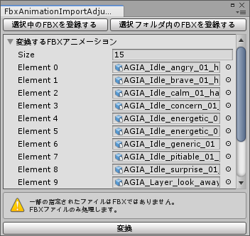

# FbxAnimationImportAdjuster
モーションキャプチャで撮影されたFBXアニメーションを、姿勢調整してAnimationClipを出力してくれるエディタ拡張

  

## 概要
Perception Neuronなどのモーションキャプチャ機材で撮影したアニメーションをUnityにインポートすると、初期ポーズがTポーズになっていないためにモーションがグチャグチャになっていることがあります。  
この場合手動でRigを修正する等しなければいけませんが非常に面倒です。  
そこで自動でRig修正を行ったうえで、アニメーションをAnimationClipとして出力してくれるエディタ拡張を作りました。  

## 使い方
1. [Booth](https://manage.booth.pm/items/2592486)からUnityPackageをダウンロードしてインポートする。
2. メニューバーより __CIFER.Tech -> FbxAnimationImportAdjuster__ を選択する。
3. 変換・調整したいFBXアニメーションを登録する。
4. 一番下に出現する『変換』ボタンを押下する。

## 動作環境
- Unity2018.4.20f1

## FAQ
### AnimationClipはどこに出力されるの？
FBXがある同一フォルダ内に生成されます。

### FBX以外のアニメーションファイルで使いたいんだけど
現在はFBXのみにしか対応していません。  
もし要望等ありましたら[Twitter](https://twitter.com/_karukaru_)へご連絡ください。

## ライセンス
本リポジトリは[MITライセンス](LICENSE)の下で公開しています。
